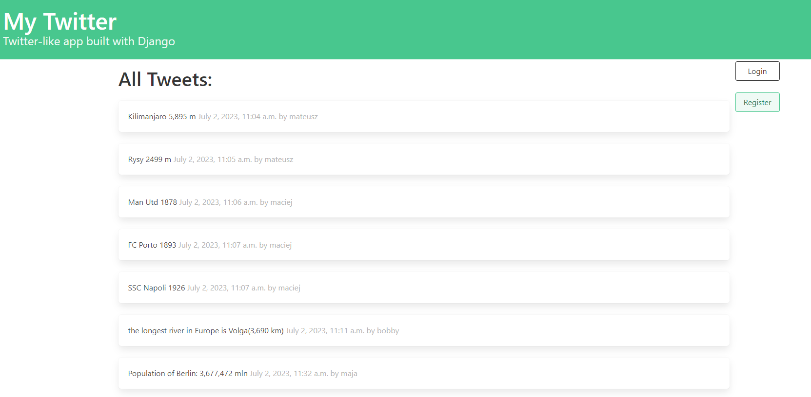
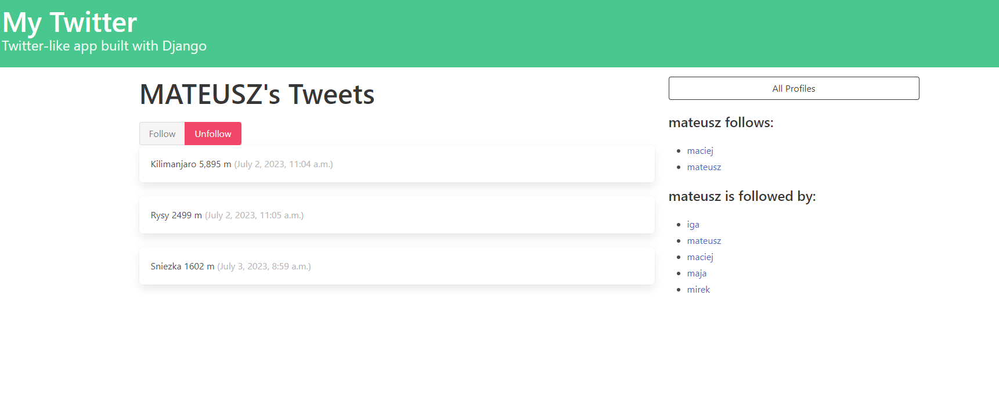

# Twitter-like application

a twitter-like app building with Django

## Installation
1. The first thing to do is to clone the repository
    ```
    git clone https://github.com/matt064/Django---twitter-like-app.git
    ```
2. Create a virtual environment to install dependencies and activate it:
    ```
    python -m venv "path_to_catalog"

    venv\Scripts\activate
    ```
3. Then install the dependencies:
    ```
    (venv) pip install -r requirements.txt


## Start App
1. Run the App:
    ```
    (venv) python manage.py runserver
    ```
2. The development server will be started at :
    ```
    http://127.0.0.1:8000/
    ```


## App Preview :

you can create your account and start following other users

<table width="100%"> 
<tr>
<td width="50%">      
&nbsp; 
<br>
<p align="center">
  Main Page
</p>

</td> 
<td width="50%">
<br>
<p align="center">
  User Page
</p>
  
</td>
</table>